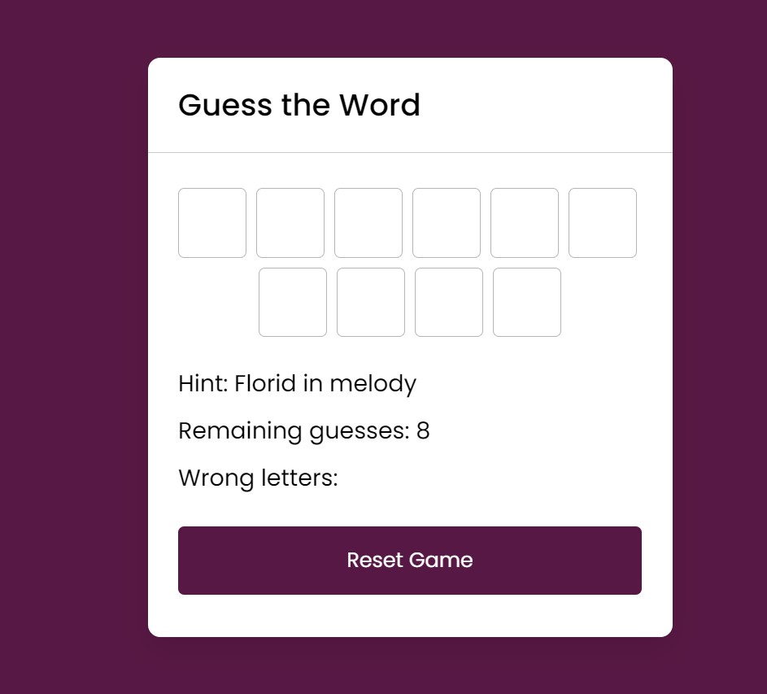
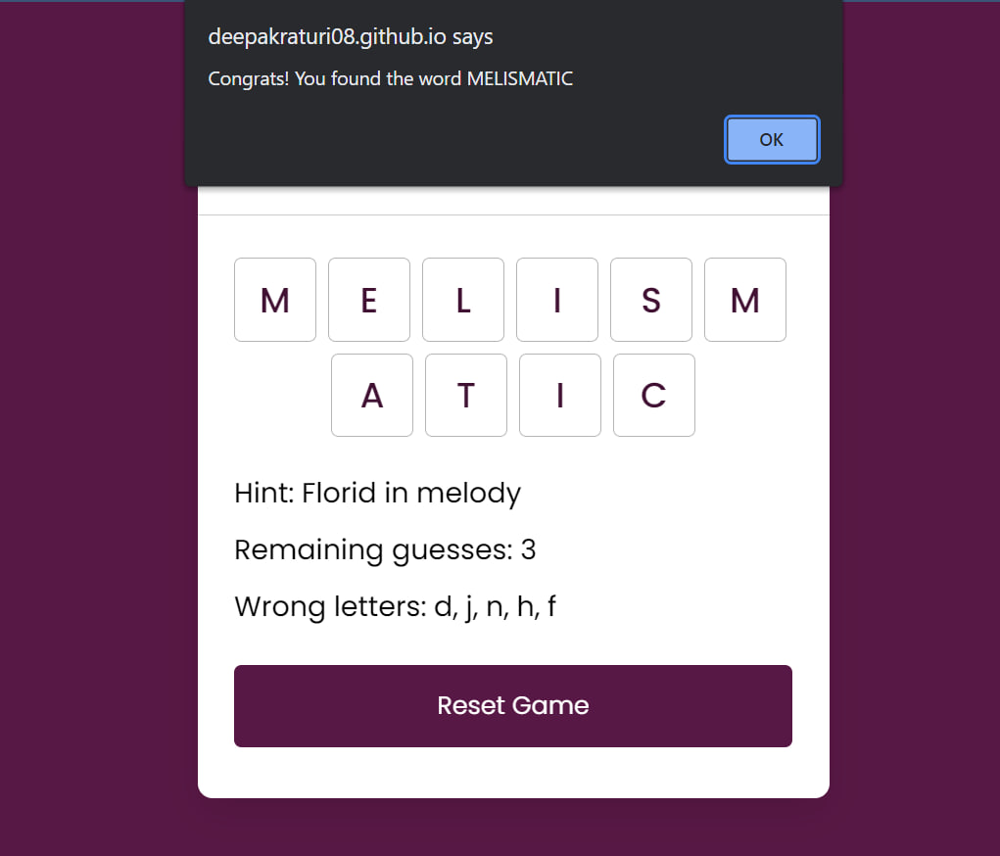

a## Word Wizard

<b>Built with</b> 

- A word guessing game where the user is given a hint and a specific number of trials to guess the word correctly.
- The game utilizes the [Random Words API](https://github.com/mcnaveen/Random-Words-API) to fetch a random word along with its corresponding hint.
- The game is designed with user interactivity in mind, incorporating event listeners to enhance the gameplay experience.

<h2><a href="https://deepakraturi08.github.io/Word-wizard/">Demo</a></h2>

# Word-wizard
